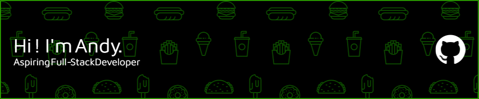

# Codecademy - Challenge Project: Company Home Page with Flexbox



## Overview

In this project, I will be using flexbox to design and build the layout for a company’s homepage.

## Features

- **Standard Elements**: A title, logo, mission statement, images of product, and employee section
- **Flexbox Styling**: Aim to use flexbox’s advantages, such as easy horizontal and vertical positioning, flexible element flows as the page size changes, and great styling for repeated elements
- **Custom Styles**: Simple color scheme, Google Fonts API, and custom images

## Screenshots

<details>
<summary>Click to view screenshots</summary>


</details>

## Technologies Used

- **Frontend**: HTML5 / CSS
- **Styling**: CSS
- **Deployment**: GitHub

## Project Structure

```
project-root/
├── index.html              # Main HTML file
├── css/                    # CSS stylesheets
│   ├── normalize.css       # CSS reset
│   ├── variables.css       # CSS variables
│   └── main.css            # Main stylesheet
├── assets/                 # Static assets
│   ├── images/             # Image files
│   ├── fonts/              # Font files
│   └── icons/              # Icon files
├── CHANGELOG.md            # CHANGELOG file
├── CONTRIBUTING.md         # CONTRIBUTING file
├── LICENSE                 # MIT License file
├── README.md               # README file
```

## Installation & Setup

### Prerequisites

- {{prerequisite-1}}
- {{prerequisite-2}}
- {{prerequisite-3}}

### Local Development

1. Clone this branch of the repository:
   ```bash
   git clone -b {{branch-name}} https://github.com/{{username}}/web-dev-projects.git
   cd web-dev-projects
   ```

2. {{setup-step-2}}

3. {{setup-step-3}}

4. {{setup-step-4}}

## Usage

{{usage-instructions}}

## Development Process

### Challenges & Solutions

During the development of this project, several challenges were encountered and overcome:

1. **{{challenge-1}}**: {{solution-1}}

2. **{{challenge-2}}**: {{solution-2}}

3. **{{challenge-3}}**: {{solution-3}}

### Future Enhancements

Plans for future development include:

- {{future-enhancement-1}}
- {{future-enhancement-2}}
- {{future-enhancement-3}}

## Performance & Optimization

This project implements the following optimizations:

- {{optimization-1}}
- {{optimization-2}}
- {{optimization-3}}

## Accessibility

Steps taken to ensure accessibility include:

- {{accessibility-feature-1}}
- {{accessibility-feature-2}}
- {{accessibility-feature-3}}

## Browser Compatibility

This project has been tested and confirmed to work on the following browsers:

- Chrome (version {{chrome-version}}+)
- Firefox (version {{firefox-version}}+)
- Safari (version {{safari-version}}+)
- Edge (version {{edge-version}}+)

## Credits & Acknowledgements

- {{credit-1}}
- {{credit-2}}
- {{credit-3}}

## License

This project is part of my web development portfolio and is licensed under the MIT License - see the [LICENSE](./LICENSE) file for details.

---

Created by [Andy Reeves](https://github.com/andy-comcast) - April 7, 2025
